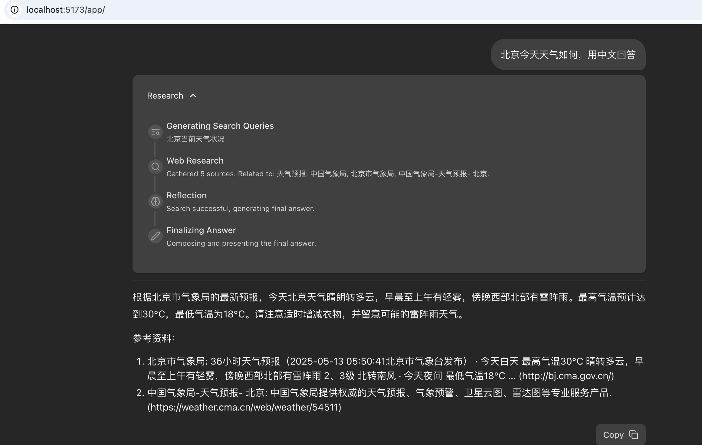
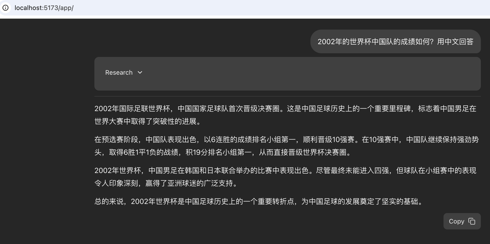

# anyllm-fullstack-langgraph-quickstart

## 简介

基于[google-gemini/gemini-fullstack-langgraph-quickstart](https://github.com/google-gemini/gemini-fullstack-langgraph-quickstart)

主要做了如下几个改动：
1. 支持本地llm(例如lm-studio启动一个qwen2.5-coder-7b-instruct),同时把gemini的api接口改成了openai形式的接口【这个代码全是codex帮改的】
2. 工具调用改成google search api进行搜索(比较慢，duckduckgo也可以，代码里DDGS相关的代码，只是会经常超限…)【这个代码是在codex改完的基础上，参考[https://github.com/leptonai/search_with_lepton/blob/main/search_with_lepton.py](https://github.com/leptonai/search_with_lepton/blob/main/search_with_lepton.py)里的google search api改的，只是我之前试过了google的所以复制了这个，当然里面还有别的search api，可以后续再试试】
3. 为了方便完全的本地调试，删掉了一些docker相关的东西

## 使用方式

1. python版本需要是3.11以上
2. 获取google search api的两个参数
    + api-key：[link](https://developers.google.com/custom-search/v1/introduction?hl=zh-cn#identify_your_application_to_google_with_api_key)
    + cx：[link](https://stackoverflow.com/questions/6562125/getting-a-cx-id-for-custom-search-google-api-python)
3. LANGSMITH_API_KEY这个可选，去langchain官网可以搞到
4. 参考```backend/.env.example```，搞一个```backend/.env```，里面的所有注释放开，改成你的base_url（lm-studio的话就是默认的那个1234端口的）、openai_api_key（本地服务就是随便写的）、google api-key、cx和LANGSMITH_API_KEY
5. 去backend目录，执行```pip3 install .```
6. 安装node.js，去frontend目录，执行```npm install```
7. 回到主目录，执行```make dev```，打开```http://localhost:5173/app/```就能用了

demo1



demo2




## Star History

<a href="https://star-history.com/#daiwk/anyllm-fullstack-langgraph-quickstart&Date">
 <picture>
   <source media="(prefers-color-scheme: dark)" srcset="https://api.star-history.com/svg?repos=daiwk/anyllm-fullstack-langgraph-quickstart&type=Date&theme=dark" />
   <source media="(prefers-color-scheme: light)" srcset="https://api.star-history.com/svg?repos=daiwk/anyllm-fullstack-langgraph-quickstart&type=Date" />
   
 </picture>
</a>

