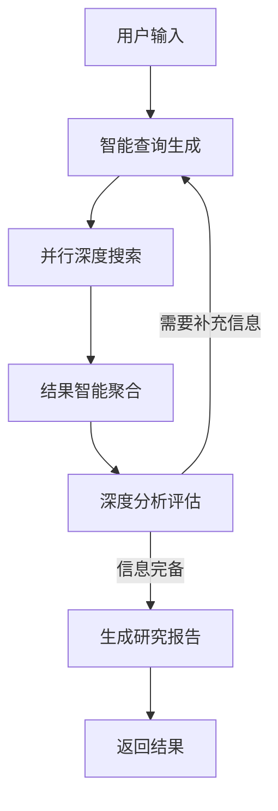

# 云思（CloudThink）- 基于 LangGraph 的智能深度搜索引擎技术报告
> 栉云科技（ZhiYun Technology）出品

## 摘要

本报告详细分析了栉云科技自主研发的云思（CloudThink）智能深度搜索引擎系统。该系统基于 LangGraph 构建，采用前后端分离架构，通过先进的状态机设计实现了复杂的多步骤深度研究流程。系统能够接收用户查询，自动生成智能搜索策略，执行深度网络搜索，分析和综合信息，最终生成高质量的研究报告。

## 目录

1. [系统架构概述](#1-系统架构概述)
2. [前端技术实现](#2-前端技术实现)
3. [后端技术实现](#3-后端技术实现)
4. [核心功能流程](#4-核心功能流程)
5. [关键技术创新](#5-关键技术创新)
6. [性能与可扩展性](#6-性能与可扩展性)
7. [技术挑战与解决方案](#7-技术挑战与解决方案)
8. [未来优化方向](#8-未来优化方向)

## 1. 系统架构概述

### 1.1 整体架构

云思采用现代化的分布式微服务架构，由栉云科技团队精心设计，主要包含以下核心组件：

- **前端层**：基于 React + TypeScript 的现代化交互界面
- **后端层**：采用 Python + FastAPI + LangGraph 的高性能服务
- **通信层**：基于 WebSocket 的实时双向通信系统
- **AI 层**：深度集成 DeepSeek 大语言模型
- **搜索层**：自研智能搜索引擎（可选配 Google Search API）

### 1.2 技术栈选型

| 层级 | 技术选择 | 选型理由 |
|------|---------|---------|
| 前端框架 | React 18 | 组件化开发、强大的生态系统 |
| 状态管理 | React Hooks | 轻量级、易于维护 |
| UI 框架 | Tailwind CSS + Shadcn | 高度可定制、现代化设计 |
| 后端框架 | FastAPI | 高性能、异步支持、自动 API 文档 |
| AI 框架 | LangGraph | 强大的状态机能力、易于扩展 |
| 模型选择 | DeepSeek | 高性能、成本效益好 |

## 2. 前端技术实现

### 2.1 核心组件架构

云思前端采用组件化设计，主要包含以下核心组件：

\`\`\`typescript
// App.tsx - 应用主入口
const App: React.FC = () => {
  const thread = useStream<{
    messages: Message[];
    initial_search_query_count: number;
    max_research_loops: number;
    reasoning_model: string;
  }>({
    apiUrl: import.meta.env.DEV ? "http://localhost:2024" : "http://localhost:8123",
    assistantId: "agent",
    messagesKey: "messages",
    onUpdateEvent: handleEventUpdate,
  });
  
  // ... 组件实现
};
\`\`\`

### 2.2 状态管理设计

云思采用 React Hooks 进行状态管理，主要包含：

1. **全局状态**
   - 消息历史
   - 处理进度
   - 系统配置

2. **本地状态**
   - 用户输入
   - UI 状态
   - 错误处理

### 2.3 实时通信实现

基于 WebSocket 的实时通信机制：

\`\`\`typescript
// 实时状态更新处理
const handleEventUpdate = (event: any) => {
  if (event.generate_query) {
    updateQueryState(event.generate_query);
  } else if (event.web_research) {
    updateResearchState(event.web_research);
  } else if (event.reflection) {
    updateReflectionState(event.reflection);
  }
};
\`\`\`

## 3. 后端技术实现

### 3.1 LangGraph 状态机设计

云思后端采用先进的 LangGraph 状态机设计，实现了复杂的多步骤研究流程：

#### 3.1.1 状态定义

\`\`\`python
# state.py
class OverallState(TypedDict):
    messages: Annotated[list, add_messages]
    search_query: Annotated[list, operator.add]
    web_research_result: Annotated[list, operator.add]
    sources_gathered: Annotated[list, operator.add]
    initial_search_query_count: int
    max_research_loops: int
    research_loop_count: int
    reasoning_model: str
\`\`\`

#### 3.1.2 节点实现

1. **查询生成节点**
\`\`\`python
def generate_query(state: OverallState, config: RunnableConfig) -> QueryGenerationState:
    configurable = Configuration.from_runnable_config(config)
    current_date = get_current_date()
    formatted_prompt = query_writer_instructions.format(
        current_date=current_date,
        research_topic=get_research_topic(state["messages"]),
        number_queries=state["initial_search_query_count"],
    )
    # ... 实现逻辑
\`\`\`

2. **网络搜索节点**
\`\`\`python
def web_research(state: WebSearchState, config: RunnableConfig) -> OverallState:
    configurable = Configuration.from_runnable_config(config)
    query = state["search_query"]
    # ... 实现逻辑
\`\`\`

3. **反思评估节点**
\`\`\`python
def reflection(state: OverallState, config: RunnableConfig) -> ReflectionState:
    configurable = Configuration.from_runnable_config(config)
    state["research_loop_count"] = state.get("research_loop_count", 0) + 1
    # ... 实现逻辑
\`\`\`

### 3.2 配置管理系统

基于 Pydantic 的配置管理：

\`\`\`python
# configuration.py
class Configuration(BaseModel):
    query_generator_model: str = Field(
        default="deepseek-chat",
        metadata={
            "description": "查询生成模型"
        },
    )
    reflection_model: str = Field(
        default="deepseek-chat",
        metadata={
            "description": "反思评估模型"
        },
    )
    # ... 其他配置项
\`\`\`

## 4. 核心功能流程

### 4.1 查询处理流程

云思的核心查询处理流程如下：

### 4.2 状态转换逻辑

云思系统的状态转换逻辑包含以下关键步骤：

1. **初始状态** → **查询生成**
   - 解析用户输入
   - 生成搜索策略

2. **查询生成** → **网络搜索**
   - 并行执行多个查询
   - 收集搜索结果

3. **网络搜索** → **反思评估**
   - 分析信息完整性
   - 确定是否需要更多查询

4. **反思评估** → **最终答案**
   - 综合所有信息
   - 生成结构化报告

## 5. 关键技术创新

### 5.1 智能查询生成

云思系统采用栉云科技自研的高级提示工程技术，生成优化的搜索查询：

\`\`\`python
query_writer_instructions = """
Your goal is to generate sophisticated and diverse web search queries.
Instructions:
- Always prefer a single search query
- Each query should focus on one specific aspect
- Don't produce more than {number_queries} queries
...
"""
\`\`\`

### 5.2 并行搜索处理

实现高效的并行搜索机制：

\`\`\`python
def continue_to_web_research(state: QueryGenerationState):
    return [
        Send("web_research", {
            "search_query": search_query,
            "id": int(idx)
        })
        for idx, search_query in enumerate(state["query_list"])
    ]
\`\`\`

### 5.3 智能反思机制

创新的反思评估算法：

\`\`\`python
def evaluate_research(state: ReflectionState, config: RunnableConfig):
    if state["is_sufficient"] or state["research_loop_count"] >= max_research_loops:
        return "finalize_answer"
    else:
        return generate_follow_up_queries(state)
\`\`\`

## 6. 性能与可扩展性

### 6.1 性能优化

云思系统在性能方面进行了全方位的优化：

1. **前端优化**
   - 虚拟滚动
   - 懒加载
   - 状态缓存

2. **后端优化**
   - 异步处理
   - 结果缓存
   - 并行执行

### 6.2 可扩展性设计

1. **模块化架构**
   - 插件系统
   - 中间件支持
   - 自定义节点

2. **配置驱动**
   - 动态配置
   - 环境变量
   - 配置文件

## 7. 技术挑战与解决方案

### 7.1 主要挑战

在云思系统的开发过程中，栉云科技团队克服了以下技术挑战：

1. **实时性要求**
   - 问题：用户需要实时反馈
   - 解决：WebSocket + 事件驱动

2. **查询质量**
   - 问题：搜索结果质量参差不齐
   - 解决：智能过滤 + 权重排序

3. **状态管理**
   - 问题：复杂状态转换
   - 解决：LangGraph 状态机

### 7.2 创新解决方案

1. **智能缓存**
   - 查询结果缓存
   - 状态快照
   - 增量更新

2. **自适应控制**
   - 动态调整查询数
   - 智能超时控制
   - 错误重试

## 8. 未来优化方向

### 8.1 技术优化

云思系统的未来技术优化方向：

1. **模型升级**
   - 持续优化 DeepSeek 模型集成
   - 支持更多大语言模型接入
   - 提供私有模型部署方案

2. **搜索增强**
   - 多源异构数据搜索
   - 实时数据采集与分析
   - 知识图谱增强检索

### 8.2 功能扩展

云思平台的功能扩展规划：

1. **多模态支持**
   - 图像理解与分析
   - 语音交互界面
   - 视频内容解析

2. **企业级功能**
   - 多租户支持
   - 团队协作空间
   - 知识库构建工具

## 结论

云思（CloudThink）智能深度搜索引擎是栉云科技在 AI 应用领域的重要突破。通过结合 React 前端框架、FastAPI 后端服务和 LangGraph 状态机，我们成功构建了一个高度智能化的研究助手系统。该系统不仅能够提供高质量的研究结果，还能够展示 AI 的思考过程，为用户提供透明且可信的服务。

未来，随着大语言模型技术的发展和系统的持续优化，云思将持续进化，为更多领域的用户提供智能化研究支持。栉云科技将继续投入研发力量，推动云思在人工智能应用领域的创新和发展，致力于为用户提供更专业、更高效的智能研究解决方案。 